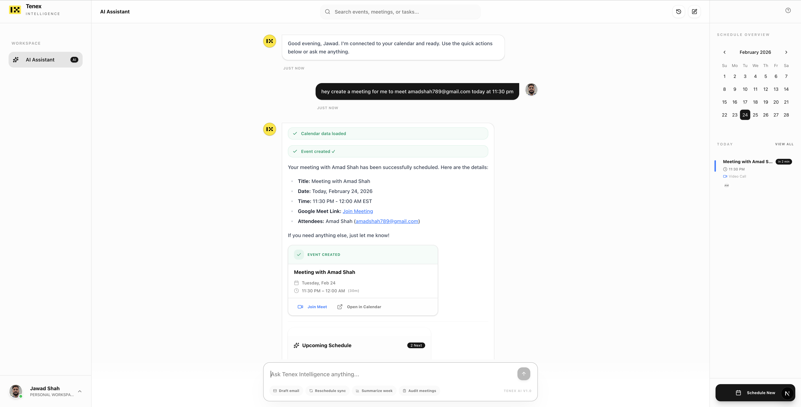

# Tenex Intelligence

An AI-powered Chief of Staff that manages your Google Calendar through natural language. Real-time scheduling, conflict detection, email drafting, and meeting analytics — all from a single chat interface.

**[Live Demo](https://fde-tenex-takehome.vercel.app/)** · **[Source Code](https://github.com/Sjs2332/Fde-tenex-takehome)**

> **FDE Take-Home Submission: Architecture Walkthrough**
> This project includes a comprehensive documentation page at `/docs` detailing every design decision, component architecture, security layer, and API surface — complete with interactive UI component previews.



---

## Features

| Feature | Description |
|---|---|
| **AI Calendar Agent** | Natural language scheduling via GPT-4o-mini with live Google Calendar API tools (`get_events`, `create_event`, `delete_event`) |
| **Conflict Detection** | Mandatory pre-check before every event creation; suggests alternatives when conflicts exist |
| **Smart Rescheduling** | Delete old + create new in one flow; sidebar updates in real-time |
| **Email Drafting** | AI asks who and what, generates a professional draft, one-click Gmail send via API |
| **Interactive Widgets** | Stats dashboard, schedule timeline, and event cards auto-rendered inline via invisible AI markers |
| **Calendar Citations** | `[[Event Name]]` in AI responses become clickable buttons → event detail modal |
| **Conversation Persistence** | Threads auto-save to Firestore (1 write per save), persist across page reloads, browsable/resumable via History dropdown |
| **Activity Audit Trail** | Every agent action (creates, deletes, fetches, email sends) logged to Firestore |
| **Event Search** | Header search bar shows and filters upcoming events in real-time |
| **Quick Actions** | One-click chips: Draft Email, Reschedule (with meeting picker modal), Summarize Week, Audit Meetings |

## Tech Stack

| Layer | Technology |
|---|---|
| Framework | Next.js 16.1.6 (App Router, Turbopack) |
| AI | Vercel AI SDK v6, OpenAI GPT-4o-mini |
| Auth | Firebase Auth (Google OAuth) |
| Database | Cloud Firestore |
| Styling | Tailwind CSS 4, shadcn/ui |
| APIs | Google Calendar API, Gmail API |
| Language | TypeScript 5, React 19 |
| Testing | Vitest, React Testing Library, jsdom |

## Architecture

```
src/
├── app/
│   ├── api/
│   │   ├── auth/session/route.ts      # HttpOnly cookie management (POST/DELETE)
│   │   ├── calendar/route.ts          # Google Calendar proxy (GET/POST)
│   │   ├── gmail/send/route.ts        # Gmail send proxy (POST)
│   │   └── chat/route.ts              # AI chat endpoint — streams via AI SDK
│   ├── app/
│   │   ├── layout.tsx                 # CalendarProvider + SidebarProvider
│   │   └── page.tsx                   # Dashboard — renders ChatInterface
│   ├── layout.tsx                     # Root: Geist fonts, AuthProvider
│   └── page.tsx                       # Landing page
├── components/
│   ├── app/
│   │   ├── chat/                      # ChatInterface, MessageRenderer, InputForm,
│   │   │                              # ToolStatus, EventCreatedCard, EmailDraftCard,
│   │   │                              # StatsGrid, ScheduleCard, ReschedulePickerModal
│   │   └── navigation/               # LeftSidebar, RightSidebar, DashboardHeader,
│   │                                  # EventDetailModal, CreateEventModal, EventCard
│   ├── docs/                          # Documentation page components
│   │   ├── data/                      # Content data arrays
│   │   ├── sections/                  # Page sections (Features, Security, etc.)
│   │   ├── shells/                    # Interactive component replicas
│   │   └── ui/                        # Reusable doc primitives
│   ├── providers/                     # AuthProvider (React Context)
│   └── ui/                           # shadcn primitive components
├── hooks/
│   ├── use-calendar.tsx               # CalendarProvider — shared event state + refetch
│   └── use-chat-session.tsx           # ChatSessionProvider — conversation ID + history
├── lib/
│   ├── ai/
│   │   ├── system-prompt.ts           # Temporal anchor, tool protocols, widget triggers
│   │   └── tools.ts                   # 3 tools with token isolation + retry logic
│   ├── auth/
│   │   └── token-manager.ts           # HttpOnly cookie read/write/clear
│   ├── services/
│   │   ├── firebase/
│   │   │   ├── auth.ts                # Google OAuth login/logout
│   │   │   ├── conversations.ts       # Save/load/delete conversations (1 write per save)
│   │   │   ├── activity.ts            # Append-only agent action audit log
│   │   │   └── users.ts              # User profile upsert on login
│   │   └── google/
│   │       └── calendar.ts            # Client-side calendar service (proxied)
│   ├── calendar-utils.ts              # Event status helpers, color utilities
│   ├── firebase.ts                    # Firebase app initialization
│   └── utils.ts                       # Tailwind merge utility
└── types/
    └── google/calendar.ts             # GoogleCalendarEvent interface
```

## Testing

The project includes an automated test suite verifying core business logic to ensure production reliability without requiring external API access or Firebase emulation.

```bash
npm run test
```

See [`TESTING.md`](./TESTING.md) for full coverage details.

## Security

| Protection | Implementation |
|---|---|
| **HttpOnly Token Storage** | Google access tokens in server-only HttpOnly cookies — not accessible via JavaScript |
| **Content Security Policy** | Strict CSP in `next.config.ts` — whitelisted origins for scripts, styles, fonts, API connections |
| **HSTS** | Strict-Transport-Security, 2-year max-age, includeSubDomains, preload |
| **XSS Prevention** | X-XSS-Protection: 1; mode=block, X-Content-Type-Options: nosniff |
| **Clickjacking Protection** | X-Frame-Options: SAMEORIGIN, frame-ancestors: self |
| **Token Isolation** | Google tokens NEVER sent to the LLM — captured in server-side closure |
| **Server-Side Proxy** | All Google API calls (Calendar, Gmail) proxy through Next.js routes — tokens never exposed to client |
| **API Retry Logic** | Google API calls retry up to 2× with exponential backoff (500ms, 1500ms) on 5xx/429 |
| **Firestore Security Rules** | User-scoped: `request.auth.uid == userId` on all paths; deny-all default |
| **Input Validation** | Request body validation in all API routes; typed JSON error responses (400, 401, 500) |
| **Rate Limiting** | In-memory sliding-window rate limiter protecting OpenAI API endpoint (30 req/min/IP) |
| **Permissions Policy** | Camera, microphone, geolocation disabled |
| **Referrer Policy** | strict-origin-when-cross-origin |

### Known Limitations

- **Token refresh**: Google access tokens expire after 1 hour. Currently requires re-login. Production fix: server-side OAuth refresh token flow.

## Getting Started

### Prerequisites

- Node.js 18+
- Firebase project with Authentication + Firestore
- Google Cloud project with Calendar API + Gmail API enabled
- OpenAI API key

### Setup

```bash
# Clone
git clone https://github.com/Sjs2332/Fde-tenex-takehome.git
cd Fde-tenex-takehome

# Install dependencies
npm install

# Configure environment
cp .env.example .env
# Fill in your Firebase config, Google Client ID, and OpenAI API key

# Start development server
npm run dev
```

### Firebase Setup

1. Enable **Google** sign-in provider in Firebase Authentication
2. Create a **Firestore** database (production mode)
3. Deploy the security rules from [`FIREBASE_SCHEMA.md`](./FIREBASE_SCHEMA.md)
4. In Google Cloud Console, enable **Calendar API** and **Gmail API**
5. Add `http://localhost:3000` to Firebase authorized domains

### Environment Variables

```env
NEXT_PUBLIC_FIREBASE_API_KEY=
NEXT_PUBLIC_FIREBASE_AUTH_DOMAIN=
NEXT_PUBLIC_FIREBASE_PROJECT_ID=
NEXT_PUBLIC_FIREBASE_STORAGE_BUCKET=
NEXT_PUBLIC_FIREBASE_MESSAGING_SENDER_ID=
NEXT_PUBLIC_FIREBASE_APP_ID=
OPENAI_API_KEY=
```

## Firestore Schema

See [`FIREBASE_SCHEMA.md`](./FIREBASE_SCHEMA.md) for the complete schema design, security rules, and required indexes.

## Trade-offs & Next Steps

| Trade-off | Production Fix |
|---|---|
| Google tokens expire in 1 hour | Server-side OAuth refresh token flow |
| Tightly coupled to Google | Abstract `CalendarInterface` for Outlook support |
| Primary calendar only | Multi-calendar selection |
| No optimistic UI for deletions | Optimistic updates with rollback |

## License

Private — FDE take-home project.
